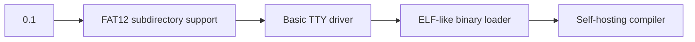
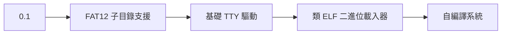

# Cyber-DOS 0.1 - 16-bit Experimental Operating System


**A minimalist 16-bit OS for x86 legacy systems, crafted with NASM and cosmic radiation.**

## 📜 Overview
Cyber-DOS is a didactic operating system targeting IBM PC-compatible hardware, implementing core system components from scratch. Designed for educational exploration of x86 real-mode programming and legacy system design.

## 🛠️ Features

### ⚡ Core Services
| Component          | Implementation Details                              |
|---------------------|-----------------------------------------------------|
| **Bootloader**      | 512-byte MBR with custom BIOS interaction            |
| **Power Management**| ACPI-less shutdown/restart via port 0x64             |
| **Clock Service**   | CMOS RTC access through INT 0x1A (BCD to ASCII conversion) |

### 📁 File System
```c
struct CyberFS {
    FAT12 implementation;  // 1.44MB floppy support
    Cluster chaining;      // Manual FAT traversal
    Directory entries;     // 8.3 filename format
    Sector-level RW;       // INT 0x13 disk services
};
```
### 🖥️ Shell Interface
```asm
CYBER-SHELL> 
  - time           Display CMOS real-time clock
  - reboot         Warm reboot via triple fault
  - dir            List root directory entries
  - edit [file]    Sector-level hex editor (WIP)
  - shutdown       APM-compatible power off
```

## 🧩 Technical Specification

### Memory Map
| Address Range     | Usage                   |
|-------------------|-------------------------|
| 0x0000-0x7BFF    | Kernel space            |
| 0x7C00-0x7DFF    | MBR                     |
| 0x7E00-0x9FFFF    | User programs           |

### Interrupt Table
| INT# | Handler Function         |
|------|--------------------------|
| 0x10 | Video services           |
| 0x13 | Disk I/O                 |
| 0x16 | Keyboard input           |
| 0x1A | Time services            |

## 🚀 Build Instructions

### Prerequisites
- NASM 2.15+
- QEMU 6.2+ (or physical 8086 system)
- DOSBox-X (for FAT image creation)

```bash
# Compile bootloader
nasm -f bin -o cyber_mbr.bin src/boot.asm

# Create disk image
dd if=/dev/zero of=cyberdisk.img bs=512 count=2880
dd if=cyber_mbr.bin of=cyberdisk.img conv=notrunc

# Run in emulator
qemu-system-i386 -drive format=raw,file=cyberdisk.img -monitor stdio
```

## 📌 Known Issues
- File system limited to root directory operations
- No memory protection (guaranteed 1980s authenticity)
- Keyboard input requires ASCII art drivers
- Power management may cause temporal anomalies

## 🌌 Roadmap


## 🤝 Contribution
Submit PRs via carrier pigeon or:
1. Fork this repository
2. Create feature branch (`git checkout -b cyber-mk2`)
3. Commit changes (`git commit -am 'Added flux capacitor driver'`)
4. Push to branch (`git push origin cyber-mk2`)
5. Open Pull Request

## 📄 License
This project is licensed under the **GNU GPLv3** - see [LICENSE.md](LICENSE) for details.

> **Warning**  
> Not responsible for spontaneous combustion of legacy hardware.  
> BIOS exorcism recommended before deployment.
```

Chinese Version

# Cyber-DOS 0.1 - 16 位元實驗性作業系統


**專為 x86 古董硬體打造的極簡 16 位元作業系統，使用 NASM 與宇宙射線鑄造而成**

## 📜 概覽
Cyber-DOS 是一款教學型作業系統，目標兼容 IBM PC 硬體架構，從零實現核心系統組件。專為探索 x86 真實模式程式設計與復古系統設計而打造。

## 🛠️ 功能特性

### ⚡ 核心服務
| 組件              | 技術實現細節                                   |
|-------------------|-----------------------------------------------|
| **開機引導程式**  | 512 位元組 MBR 自訂 BIOS 交互                  |
| **電源管理**      | 透過 Port 0x64 實現無 ACPI 關機/重啟          |
| **時鐘服務**      | 透過 INT 0x1A 存取 CMOS 即時時鐘 (BCD 轉 ASCII)|

### 📁 檔案系統
```c
struct CyberFS {
    FAT12 實作;        // 支援 1.44MB 軟碟
    叢集鏈追蹤;        // 手動 FAT 表遍歷
    目錄條目;          // 8.3 檔名格式
    磁區級讀寫;        // 使用 INT 0x13 磁碟服務
};
```

### 🖥️ 命令殼層
```asm
CYBER-SHELL> 
  - time           顯示 CMOS 即時時鐘
  - reboot         三重錯誤觸發熱重啟
  - dir            列出根目錄條目
  - edit [檔案]    磁區級十六進位編輯器 (開發中)
  - shutdown       相容 APM 的關機指令
```

## 🧩 技術規格

### 記憶體映射
| 位址範圍          | 用途                     |
|-------------------|-------------------------|
| 0x0000-0x7BFF    | 核心空間                 |
| 0x7C00-0x7DFF    | MBR 引導區               |
| 0x7E00-0x9FFFF    | 使用者程式空間           |

### 中斷向量表
| 中斷號 | 處理函式               |
|-------|------------------------|
| 0x10  | 顯示服務               |
| 0x13  | 磁碟 I/O               |
| 0x16  | 鍵盤輸入               |
| 0x1A  | 時間服務               |

## 🚀 編譯指南

### 環境需求
- NASM 2.15+
- QEMU 6.2+ (或實體 8086 系統)
- DOSBox-X (用於建立 FAT 映像檔)

```bash
# 編譯開機引導程式
nasm -f bin -o cyber_mbr.bin src/boot.asm

# 建立磁碟映像
dd if=/dev/zero of=cyberdisk.img bs=512 count=2880
dd if=cyber_mbr.bin of=cyberdisk.img conv=notrunc

# 在模擬器執行
qemu-system-i386 -drive format=raw,file=cyberdisk.img -monitor stdio
```

## 📌 已知問題
- 檔案系統僅支援根目錄操作
- 無記憶體保護機制 (保證 1980 年代原汁原味)
- 鍵盤輸入需 ASCII 藝術驅動程式
- 電源管理可能引發時空異常

## 🌌 發展路線


## 🤝 貢獻指南
建議透過飛鴿傳書提交 PR，或：
1. 複刻本儲存庫
2. 建立功能分支 (`git checkout -b cyber-mk2`)
3. 提交修改 (`git commit -am '新增磁通電容驅動'`)
4. 推送分支 (`git push origin cyber-mk2`)
5. 開啟 Pull Request

## 📄 授權協議
本專案採用 **GNU GPLv3** 授權 - 詳見 [LICENSE.md](LICENSE)

> **警告**  
> 不對古董硬體自燃現象負責。  
> 部署前建議先進行 BIOS 驅魔儀式。
