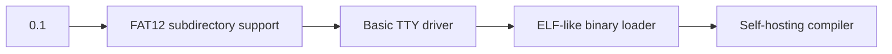

# Cyber-DOS 0.1 - 16-bit Experimental Operating System


**A minimalist 16-bit OS for x86 legacy systems, crafted with NASM and cosmic radiation.**

## 📜 Overview
Cyber-DOS is a didactic operating system targeting IBM PC-compatible hardware, implementing core system components from scratch. Designed for educational exploration of x86 real-mode programming and legacy system design.

## 🛠️ Features

### ⚡ Core Services
| Component          | Implementation Details                              |
|---------------------|-----------------------------------------------------|
| **Bootloader**      | 512-byte MBR with custom BIOS interaction            |
| **Power Management**| ACPI-less shutdown/restart via port 0x64             |
| **Clock Service**   | CMOS RTC access through INT 0x1A (BCD to ASCII conversion) |

### 📁 File System
```c
struct CyberFS {
    FAT12 implementation;  // 1.44MB floppy support
    Cluster chaining;      // Manual FAT traversal
    Directory entries;     // 8.3 filename format
    Sector-level RW;       // INT 0x13 disk services
};
```
### 🖥️ Shell Interface
```asm
CYBER-SHELL> 
  - time           Display CMOS real-time clock
  - reboot         Warm reboot via triple fault
  - dir            List root directory entries
  - edit [file]    Sector-level hex editor (WIP)
  - shutdown       APM-compatible power off
```

## 🧩 Technical Specification

### Memory Map
| Address Range     | Usage                   |
|-------------------|-------------------------|
| 0x0000-0x7BFF    | Kernel space            |
| 0x7C00-0x7DFF    | MBR                     |
| 0x7E00-0x9FFFF    | User programs           |

### Interrupt Table
| INT# | Handler Function         |
|------|--------------------------|
| 0x10 | Video services           |
| 0x13 | Disk I/O                 |
| 0x16 | Keyboard input           |
| 0x1A | Time services            |

## 🚀 Build Instructions

### Prerequisites
- NASM 2.15+
- QEMU 6.2+ (or physical 8086 system)
- DOSBox-X (for FAT image creation)

```bash
# Compile bootloader
nasm -f bin -o cyber_mbr.bin src/boot.asm

# Create disk image
dd if=/dev/zero of=cyberdisk.img bs=512 count=2880
dd if=cyber_mbr.bin of=cyberdisk.img conv=notrunc

# Run in emulator
qemu-system-i386 -drive format=raw,file=cyberdisk.img -monitor stdio
```

## 📌 Known Issues
- File system limited to root directory operations
- No memory protection (guaranteed 1980s authenticity)
- Keyboard input requires ASCII art drivers
- Power management may cause temporal anomalies

## 🌌 Roadmap


## 🤝 Contribution
Submit PRs via carrier pigeon or:
1. Fork this repository
2. Create feature branch (`git checkout -b cyber-mk2`)
3. Commit changes (`git commit -am 'Added flux capacitor driver'`)
4. Push to branch (`git push origin cyber-mk2`)
5. Open Pull Request

## 📄 License
This project is licensed under the **GNU GPLv3** - see [LICENSE.md](LICENSE) for details.

> **Warning**  
> Not responsible for spontaneous combustion of legacy hardware.  
> BIOS exorcism recommended before deployment.
